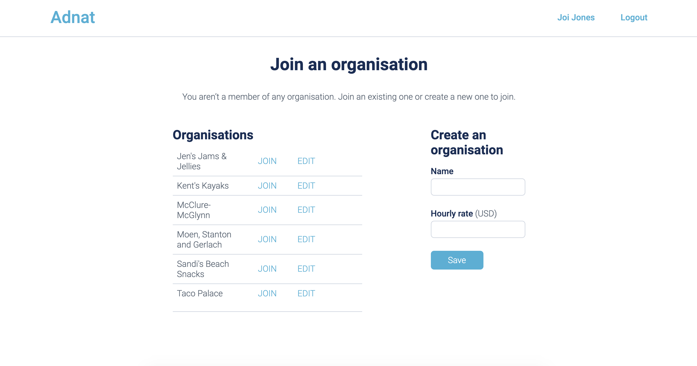
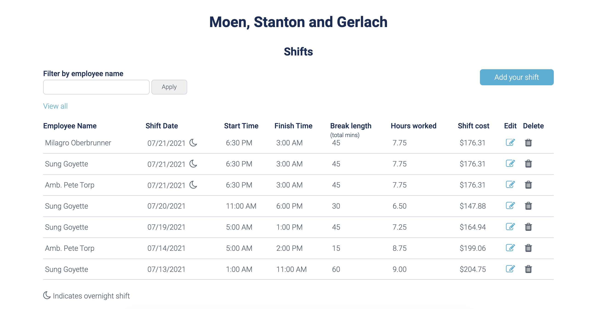

# ADNAT

This Ruby on Rails apps helps users track work shifts. After creating an account, users can either join an organisation or create a new one.

 

As a member of an organisation users can log their own work shifts as well as edit and delete shifts of other employees. Users can also view a list of all shifts at the organisation, including the following details about each shift:
* Employee name
* Shift date
* Shift overnight status
* Start time
* Finish time
* Break length (mins)
* Hours worked
* Shift cost 

 

The list can be filtered by employee first or last name, and provides links for editing or deleting individual shift records.

# Set up guide
## Dependencies
This app utilizes:
* Ruby language - version 2.6.1p33
* Rails - version 6.0.4

## Clone
In your terminal, navigate to the folder where you want to store this repo then run the command:
<pre>
$ git clone https://github.com/staceymck/adnat.git
</pre>

## Launch on localhost
You are now ready to launch the app locally. In your terminal, first run `yarn add @rails/webpacker`. Then run `rails s` then navigate to localhost:3000 in your browser.

You can use the following seed data account to sign in or create a new user account:
* Email: joi@company.com
* Password: 123456